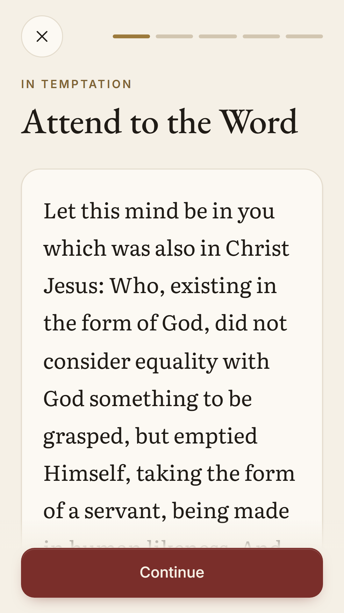
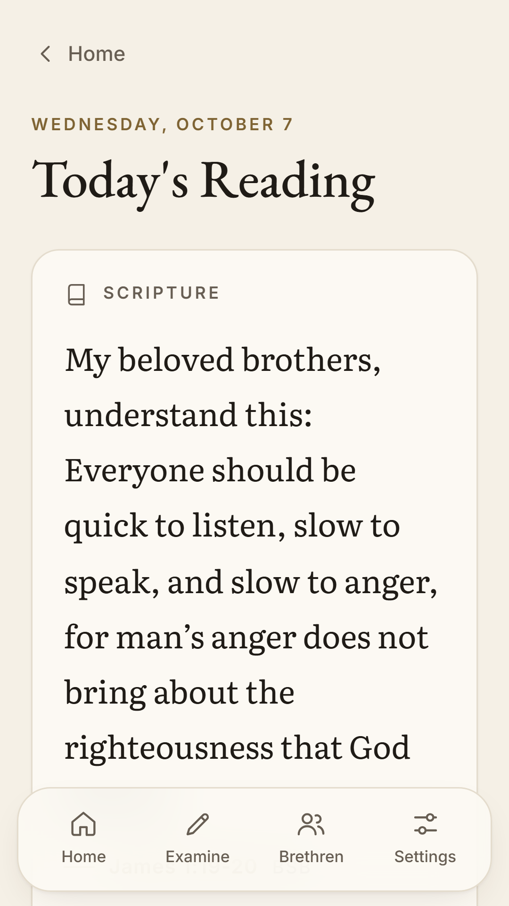
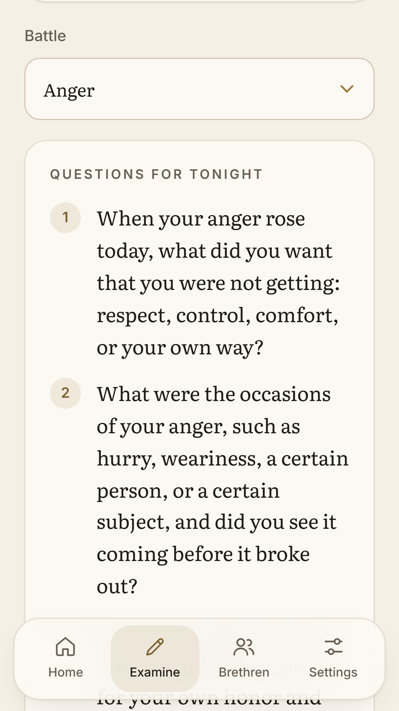
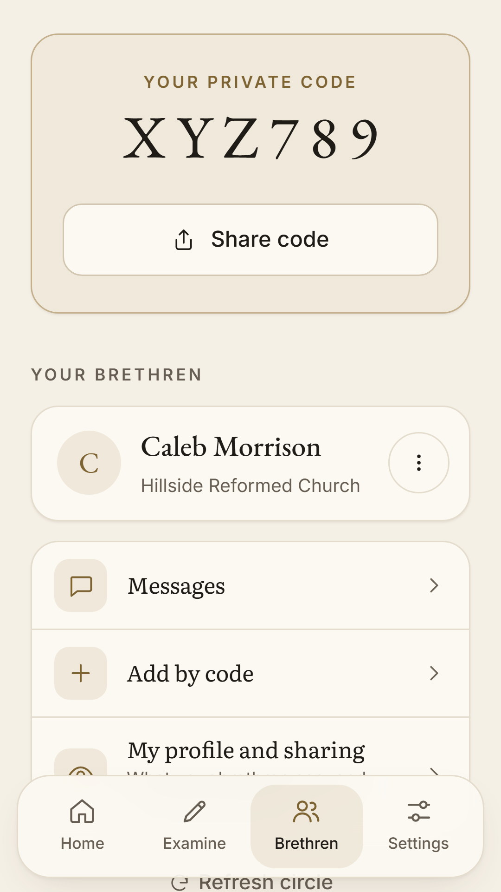

# Mortify

A browser-first Christian app for Scripture, prayer, private examination, and a small accepted circle of brethren. Work followed the three prompt files in order. The phase-by-phase file list and test instructions are in [docs/PHASES.md](docs/PHASES.md).

## Screenshots

<p>
  
  
  
  
  
  
</p>

Store-size light-mode screenshots are in [docs/screenshots](docs/screenshots): `play-1080x1920/` for Google Play and `appstore-1290x2796/` for the App Store.

## Run locally

Use Node 22.18+ or Node 24. On Windows, use `npm.cmd` if PowerShell blocks `npm.ps1`.

```sh
npm ci
npm run dev
```

Core features need no account. Scripture comes from the full official Berean Standard Bible download in `public/bible/bsb.json`; packs contain references only. Counsel, prayers, catechism, gospel and Lord's Day copy still have **obvious placeholders** under `public/content/`; the owner must supply and check that content. `/debug` validates packs. Content schemas are in `src/content/loader.ts`. See [BSB integration, changed files and tests](docs/BSB-BIBLE.md).

```sh
npm test
npm run test:database
npm run build
node scripts/check-bible-cache.mjs
npm run preview
npm run check:edge
```

Install/offline behavior should be tested against the production preview, not the development server. Load all content while online, install the app, then disable networking and reopen. Complete onboarding, establish a PIN, save an examination, lock/reopen, and check that the correct PIN is required. JSON exports deliberately contain readable text.

## External setup and native builds

- [PWA on GitHub Pages](docs/PWA-DEPLOYMENT.md)
- [Supabase migrations, RLS, authentication, Realtime, push and cron](docs/SUPABASE-SETUP.md)
- [Capacitor, Firebase, biometric keys and native reminders](docs/NATIVE-SETUP.md)
- [Android VPN engine and device tests](docs/ANDROID-SHIELD.md)
- [Apple Family Controls entitlement and tests](docs/IOS-SHIELD.md)
- [Widgets and discreet icons](docs/WIDGETS-DISCREET.md)
- [Signed bundles and TestFlight](docs/STORE-RELEASE.md)
- [Store listing drafts](docs/STORE-LISTINGS.md) and [privacy policy draft](docs/PRIVACY-POLICY-DRAFT.md)

Copy `.env.example` to `.env.local` and fill only public client configuration. For the GitHub Pages build, add the same three `VITE_` values as repository secrets. Service-role, webhook, VAPID private and Firebase service-account credentials belong in server secrets. Journal text reaches Supabase only as ciphertext encrypted on the device with the user's PIN.

## Validation status

The production PWA builds; 29 unit/component tests and isolated PostgreSQL policy checks pass. The BSB build check verifies that the full, unchanged JSON is in the service-worker precache. All Edge Functions type-check with Deno; npm audit reports zero vulnerabilities. No browser surface was available in the connected computer-use tool, so visual/install/offline checks are still pending. The PWA is live on GitHub Pages at https://z3r0colt.github.io/mortifyapp/ with the brethren features off until Supabase keys are added. Supabase/Firebase deployment and live delivery have not been performed.

Android sync and resource/manifest processing pass. Custom Kotlin sources compile directly against the SDK/dependencies, and DNS wire checks pass, but sandbox SDK access prevented the full Gradle build. The full VPN engine is included as pinned source and is built with `-PmortifyShield`; default native builds retain the guide when the binary is absent. iOS needs a Mac to complete Firebase SPM sync, compile, sign, and test. No signed store uploads or entitlement approvals have occurred.
